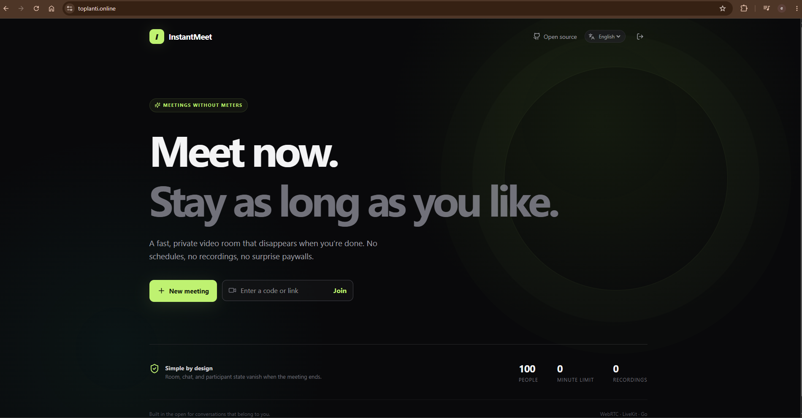
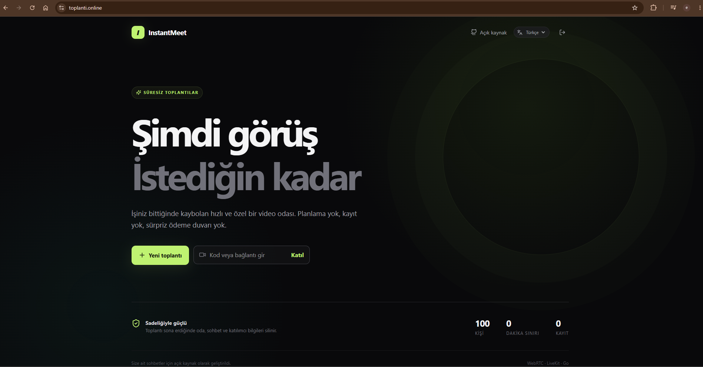
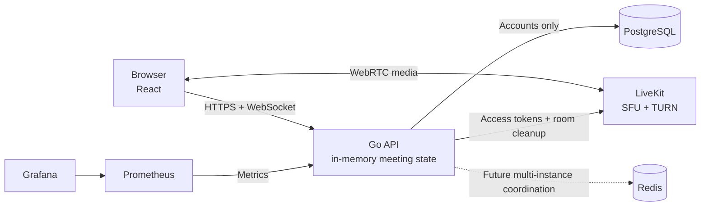

# InstantMeet

InstantMeet is an open-source, self-hostable video meeting application built
around one simple idea: create a meeting, share a link, talk, and leave. No
recordings, no meeting history, no scheduling, no subscriptions, and no
artificial time limits.

[](https://toplanti.online)

<details>
<summary>Türkçe arayüz</summary>



</details>

## Live demo

Try InstantMeet at **[toplanti.online](https://toplanti.online)**.

> The public demo is provided for evaluation. Availability and capacity may
> vary during testing; InstantMeet remains fully self-hostable.

## Why InstantMeet?

Modern meeting platforms increasingly revolve around calendars, recordings,
AI assistants, subscriptions, and features many conversations never need.
InstantMeet intentionally takes a smaller, more private approach.

Meetings are temporary. They exist only while people are talking. When the
meeting ends, the room, participant state, and chat disappear with it.

## Features

- Google OAuth 2.0 authentication with secure session cookies
- One-click meetings with human-friendly, shareable room IDs
- Host-controlled waiting room with admit and reject controls
- Audio, video, and screen sharing through LiveKit
- Public room chat and participant-to-participant private messages
- Host mute, remove, and end-meeting controls
- Support for up to **100 participants per meeting**
- Automatic in-memory cleanup when the host ends or the last person leaves
- Self-hosted Docker Compose stack with automatic HTTPS
- Production health checks, Prometheus metrics, and Grafana dashboards

## Ephemeral by design

PostgreSQL stores user accounts only. Meeting state, participants, and chat
remain in process memory and are permanently discarded when a meeting ends.
Private messages are delivered only to their sender and recipient and are
filtered from every other participant's history and meeting updates.

Redis is included in the deployment stack for future multi-instance
coordination, but the current single-node release deliberately does not persist
meeting state there.

## Architecture



All meeting mutations pass through the authenticated API. WebSocket connections
require both a valid session and room membership; clients cannot inject meeting
events over the socket. See [the architecture notes](docs/architecture.md) for
the full design.

## Quick start

1. Copy `.env.example` to `.env`.
2. Create a Google OAuth web client and set `GOOGLE_CLIENT_ID` and
   `GOOGLE_CLIENT_SECRET`. Add
   `http://localhost/api/auth/google/callback` as an authorized redirect URI.
3. Replace `JWT_SECRET` with a random value of at least 32 characters.
4. Run `docker compose up --build`.
5. Open [http://localhost](http://localhost).

If you previously started Compose with the old UUID `users` schema, recreate
the Postgres volume once with `docker compose down -v` so `init.sql` can apply.

For local UI work without Google credentials, set `DEV_AUTH_ENABLED=true` in
`.env`. The demo-login link is available only through the Vite development
server; production builds never expose it.

## Local development

Start PostgreSQL, Redis, and LiveKit:

```sh
docker compose up postgres redis livekit
```

Run the API:

```sh
cd backend
go mod download
set FRONTEND_URL=http://localhost:5173
go run ./cmd/server
```

Run the frontend in another terminal:

```sh
cd frontend
npm install
npm run dev
```

The Vite server proxies API and WebSocket traffic to port 8080.

## Production deployment

The repository includes a hardened single-server deployment using Caddy,
PostgreSQL, Redis, LiveKit, the Go API, React, Prometheus, and Grafana.

1. Point the root, `www`, and `livekit` DNS records to the server.
2. Clone the repository onto an Ubuntu host.
3. Run `sudo bash scripts/bootstrap-ubuntu.sh`.
4. Create `.env.production` with `scripts/init-production-env.sh`, then add
   Google OAuth credentials.
5. Run `bash scripts/deploy.sh`.
6. Run `bash scripts/smoke-production.sh` and complete the two-user media check.

Caddy obtains and renews TLS certificates automatically. PostgreSQL, Redis,
application APIs, and LiveKit signaling remain private to the Docker network.
The current release supports one backend instance; horizontal scaling requires
Redis-backed meeting state and distributed WebSocket coordination.

See the complete [deployment guide](docs/deploy.md) for DNS, firewall, TURN,
monitoring, validation, and secret-rotation instructions.

## Documentation

- [Architecture](docs/architecture.md)
- [API reference](docs/api.md)
- [Deployment guide](docs/deploy.md)
- [Current state](docs/current-state.md)
- [Roadmap](docs/roadmap.md)

## License

MIT — see [LICENSE](LICENSE).
